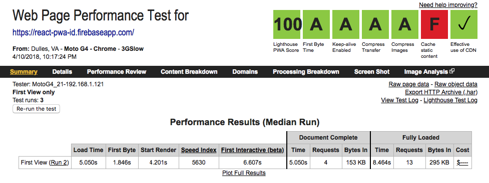
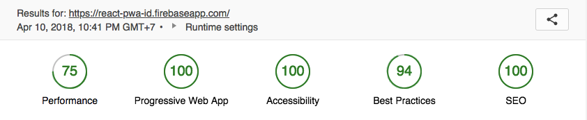
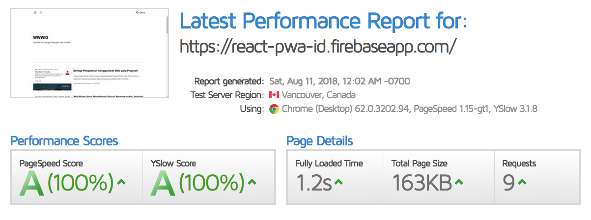

# React CRA PWA WWWID
An example of a PWA built in React Redux with Create React App for WWWID Performance Challenge.

Live Preview : https://react-pwa-id.firebaseapp.com/

 

See webpagetest.org performance test in April 16, 2018 [Click here](https://www.webpagetest.org/result/180416_BK_c2aafe31c07fde3718500ec0d3216b32/)

 
 

See webpagetest.org lighthouse score in August 7, 2018 [Click here](https://www.webpagetest.org/result/180807_ZA_820339d4ec6019b971718910304f3d19/)

 
 

See gtmetrix.com performance report in August 11, 2018
[Click here](https://gtmetrix.com/reports/react-pwa-id.firebaseapp.com/Z4XXLavh)

## Features
- [x] PWA - Progressive Web Application
- [x] State Management using Redux
- [x] Code Splitting
- [x] Hot Reloading
- [x] Offline support. Thanks to service workers.
- [x] Lazy Loading Image
- [x] SEO - Search Engine Optimizations
- [x] Image optimizations and WebP Support using Cloudinary
- [x] Webpack Bundle Analyzer
- [ ] Web Share API
- [ ] Push Notification
- [ ] Content Folding
- [x] Gzip Compression with Nginx (Include in Dockerfile)
- [x] Prerender Support with Nginx Middleware (Include in Dockerfile)
- [x] Cache Control with Nginx (Include in Dockerfile)

## Medium Article
https://medium.com/@rizalibnu/optimasi-load-progressive-web-application-pwa-dengan-react-js-kurang-dari-5-detik-dalam-koneksi-9c33980b68c0

## Challenge Information
https://medium.com/wwwid/tantangan-web-developer-untuk-membuat-aplikasi-web-bisa-digunakan-kurang-dari-5-detik-70bb7431741d

## API End Point
https://api.rss2json.com/v1/api.json?rss_url=https%3A%2F%2Fmedium.com%2Ffeed%2Fwwwid

## Setup

1. Clone the repo
2. `$ cd react-pwa-wwwid`
3. Run `$ yarn` or `npm install`
4. Run locally `$ yarn start` or `npm run start`

## Issues

Feel free to submit issues and enhancement requests.

### License

Released under the MIT License. Check `LICENSE` file for more info.

Built with ♥ in Jakarta & Cilacap